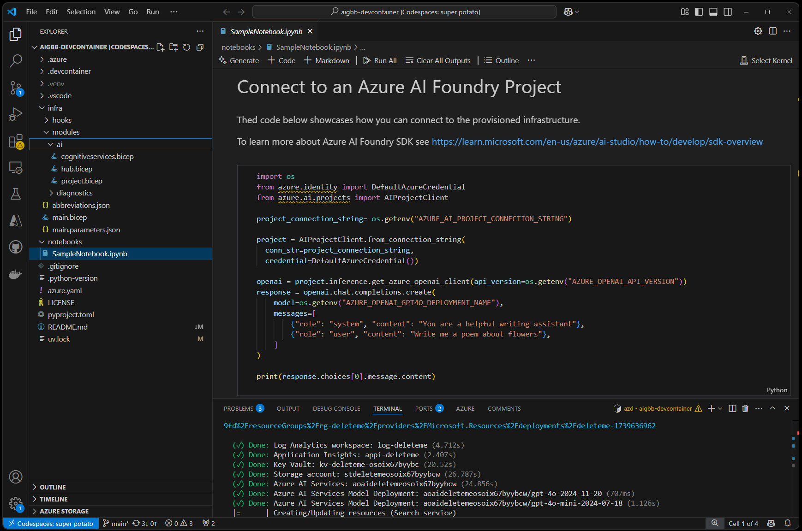

# DevContainer Template for AI work

This is a template for working on Development Containers or GitHub Codespaces with Python and Jupyter Notebooks that I use when working on AI Development projects.

Feedback and bug reports are very welcome! Please open an GitHub issue if you find something that needs fixing or improvement.



## Getting Started

[](https://codespaces.new/dbroeglin/aigbb-devcontainer) [](https://vscode.dev/redirect?url=vscode://ms-vscode-remote.remote-containers/cloneInVolume?url=https://github.com/dbroeglin/aigbb-devcontainer)

> [!WARNING]
> Do NOT `git clone` the application under Windows and then open a DevContainer. 
> This would create issues with file end of lines. For DevContainer click on the button 
> above and let Visual Studio Code download the repository for you. Alternatively you 
> can also `git clone` under Windows Subsystem for Linux (WSL) and ask Visual Studio Code to
> `Re-Open in Container`.

### Provision Azure Resources

Login with AZD:
```bash
azd auth login
``` 

To provision your Azure resources run:
```bash
azd up
``` 

If you want to deploy Azure AI Search run:
```bash
azd env set USE_AI_SEARCH true
azd up
``` 

> [!NOTE]
> Azure AI Search is not provisioned by default due to the increased cost
> and provisioning time.

### Start working

🚀 You can start working straight away by modifying `notebooks/SampleNotebook.ipynb`!

## Pre-configured AI Models

This template declares its default Azure AI Foundry model catalog in [`infra/deployments.yaml`](infra/deployments.yaml).

The Foundry account and project are provisioned by Bicep first. Model deployments are then reconciled in a separate post-provision step by [`infra/scripts/deploy_models.py`](infra/scripts/deploy_models.py), which is triggered automatically by AZD and can also be run manually.

You can refresh API-backed model metadata in [`infra/deployments.yaml`](infra/deployments.yaml) from the live Foundry account with [`infra/scripts/sync_deployments_catalog.py`](infra/scripts/sync_deployments_catalog.py). The sync script uses the Azure management `models` endpoint behind `az cognitiveservices account list-models` and updates the current catalog entries in place.

To run the model deployment stage manually:

```bash
uv run python infra/scripts/deploy_models.py --mode manual
```

To refresh the catalog from Azure before deploying:

```bash
uv run python infra/scripts/sync_deployments_catalog.py --dry-run
uv run python infra/scripts/sync_deployments_catalog.py
```

The catalog sync preserves local curation fields such as `runModes`, `allowedRegions`, `requiresRegistration`, `registrationUrl`, and `notes`. Existing `sku.capacity` values are also preserved by default so the sync does not overwrite your chosen quota allocations. Use `--sync-capacity` only if you explicitly want to reset them to Azure's current default capacity.

`--append-new` is intentionally not part of the normal workflow right now. Keep new model additions curated manually so each new entry can be reviewed for region limits, registration requirements, and deployment intent before it is committed to the catalog.

To skip the automatic post-provision rollout for an environment:

```bash
azd env set DEPLOY_AI_FOUNDRY_MODELS false
```

The active catalog includes a mix of OpenAI, Microsoft, and partner models. Some entries remain commented out because they are region-limited, require registration, or need extra access configuration.

### Commented Out (available in other regions or require registration)

Additional models are available but commented out in `deployments.yaml`. Uncomment to enable:

| Provider | Models | Notes |
|----------|--------|-------|
| **DeepSeek** | DeepSeek-R1, DeepSeek-V3.1, DeepSeek-V3.2, DeepSeek-V3.2-Speciale | May require different region |
| **Meta** | Llama-4-Maverick, Llama-3.2 Vision, Meta-Llama-3.x series | May require different region |
| **Mistral AI** | Mistral-Large-2411/3, Mistral-Nemo, Ministral-3B, Codestral-2501 | May require different region |
| **Cohere** | Cohere-command-a/r, embed-v-4-0 | May require different region |
| **xAI** | grok-3, grok-3-mini, grok-4 series | May require different region |
| **Microsoft** | Phi-4, Phi-3.5 series, MAI-DS-R1, model-router | May require different region |
| **Moonshot AI** | Kimi-K2-Thinking | May require different region |
| **OpenAI (Image/Video)** | gpt-image-1 series, sora, sora-2 | Require registration |
| **Black Forest Labs** | FLUX.2-pro, FLUX.1-Kontext-pro, FLUX-1.1-pro | Image generation |

> [!NOTE]
> Model availability varies by Azure region. This template is tested in **Sweden Central**.
> Some models (o3-pro, codex-mini, gpt-5.2-codex) are only available in East US2 & Sweden Central.
> 
> For the latest model availability, see [Azure AI Foundry Models Documentation](https://learn.microsoft.com/en-us/azure/ai-foundry/foundry-models/concepts/models-sold-directly-by-azure).

## Contents

  - `notebook/SampleNotebook.ipynb` contains a sample for using [Azure AI Foundry SDK](https://learn.microsoft.com/en-us/azure/ai-studio/how-to/develop/sdk-overview)
  - `pyproject.toml` to manage your Python configuration. Dependencies are automatically installed when the DevContainer is setup (see https://github.com/dbroeglin/aigbb-devcontainer/blob/main/.devcontainer/devcontainer.json#34)
  - `.devcontainer/devcontainer.json` a [Development Container](https://containers.dev/) (works also as a [GitHub Codespace](https://github.com/features/codespaces)) configuration file that includes:
    - Features:
      - [Azure CLI](https://learn.microsoft.com/en-us/cli/azure/what-is-azure-cli): `az`
      - [Azure Developer CLI](https://learn.microsoft.com/en-us/azure/developer/azure-developer-cli/overview): `azd`
      - [GitHub CLI](https://cli.github.com/): `gh`
      - [Node JS](https://nodejs.org/): `node` and `npm`
      - Docker in Docker to run `docker` commands from the DevContainer
    - Extensions:
      - [GitHub Copilot](https://github.com/features/copilot)
      - several Visual Studio Code extensions for Azure
      - a YAML extension
      - [Jupyter Notebooks](https://code.visualstudio.com/docs/datascience/jupyter-notebooks)
      - [UV](https://docs.astral.sh/uv/) UV is my go-to package manager for Python. Alternatively if you want to use `pip` check out the [`feature/pip`](https://github.com/dbroeglin/aigbb-devcontainer/tree/feature/pip) branch.
      - [Starship](https://starship.rs) to manage the terminal prompt.
      - [Many others](https://github.com/dbroeglin/aigbb-devcontainer/blob/main/.devcontainer/devcontainer.json#12)
  - `.gitignore` for Python
  - Open Source MIT `LICENSE`


