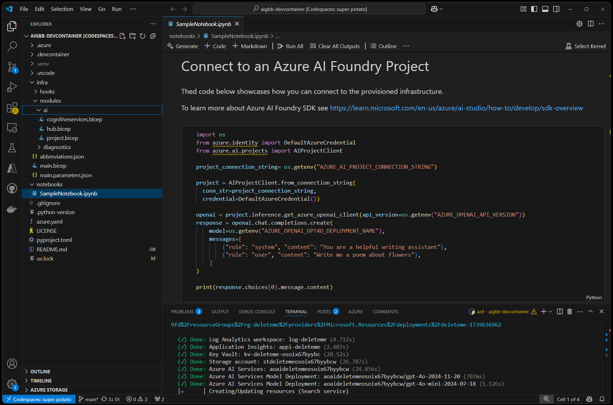

# Microsoft Foundry Dev Container Template

This repository is a template for working in Development Containers or GitHub
Codespaces with Python, Microsoft Foundry, and Jupyter notebooks.

Feedback and bug reports are welcome. Please open a GitHub issue if you find something that needs fixing or improvement.



## Getting Started

[](https://codespaces.new/Azure-Samples/az-ai-devcontainer) [](https://vscode.dev/redirect?url=vscode://ms-vscode-remote.remote-containers/cloneInVolume?url=https://github.com/Azure-Samples/az-ai-devcontainer)

> [!WARNING]
> Do NOT `git clone` the application under Windows and then open a DevContainer. 
> This would create issues with file end of lines. For DevContainer click on the button 
> above and let Visual Studio Code download the repository for you. Alternatively you 
> can also `git clone` under Windows Subsystem for Linux (WSL) and ask Visual Studio Code to
> `Re-Open in Container`.

### Provision Azure Resources

Login with AZD:
```bash
azd auth login
``` 

To provision your Azure resources run:
```bash
azd up
``` 

If you want to deploy Azure AI Search run:
```bash
azd env set USE_AI_SEARCH true
azd up
``` 

> [!NOTE]
> Azure AI Search is not provisioned by default due to the increased cost
> and provisioning time.

### Start working

🚀 You can start working straight away by modifying `notebooks/SampleNotebook.ipynb`!

## Foundry Tools Capabilities

The template provisions one Microsoft Foundry `AIServices` resource and uses it
as the shared Foundry Tools resource. It does not create separate Document
Intelligence, Content Safety, Speech, Vision, Language, or Translator accounts
by default.

| Capability | AZD endpoint variable | Notes |
| --- | --- | --- |
| Document Intelligence | `AZURE_DOCUMENT_INTELLIGENCE_ENDPOINT` | Prebuilt and custom document extraction |
| Content Understanding | `AZURE_CONTENT_UNDERSTANDING_ENDPOINT` | Create analyzers when you have a document schema |
| Content Safety | `AZURE_CONTENT_SAFETY_ENDPOINT` | Text and image moderation |
| Vision | `AZURE_AI_VISION_ENDPOINT` | Image analysis and OCR |
| Language | `AZURE_AI_LANGUAGE_ENDPOINT` | Text analytics, PII detection, and custom language |
| Speech | `AZURE_AI_SPEECH_ENDPOINT` | Speech-to-text, text-to-speech, and diarization |
| Translator | `AZURE_AI_TRANSLATOR_ENDPOINT` | Text and document translation |

All service-specific endpoint variables currently resolve to
`AZURE_AI_SERVICES_ENDPOINT`; use `AZURE_AI_SERVICES_REGION` with SDKs that
require a region. `AI_FOUNDRY_ENDPOINT` remains the endpoint for Foundry
resource and Content Understanding operations. Use
`AZURE_CONTENT_UNDERSTANDING_API_VERSION` (`2025-11-01`) for Content
Understanding REST calls.

The deployment disables local/key authentication. The deployment principal is
assigned **Cognitive Services User** directly on the Foundry resource, which
grants the data-plane access required to invoke these APIs with Microsoft Entra
ID. The template's storage account also grants that principal **Storage Blob
Data Contributor** for document input and output.

For local development, authenticate through the Azure CLI/VS Code credential
chain:

```python
from azure.identity import DefaultAzureCredential

credential = DefaultAzureCredential()
```

For an Azure-hosted workload, use its managed identity instead of
`DefaultAzureCredential`, and assign that identity **Cognitive Services User**
on the Foundry resource plus the least-privilege storage data role it needs.

After `azd up`, verify that the signed-in identity can call both Document
Intelligence and Content Understanding without keys:

```bash
uv run python infra/scripts/verify_foundry_tools.py
```

The access-only baseline does not create a Content Understanding analyzer,
custom Document Intelligence model, or sample document. Create those after you
have a workload-specific schema and retention requirements. If you need
service isolation, a different region, or independent billing, you can still
override `DOCUMENTINTELLIGENCE_ENDPOINT` with a dedicated resource before
provisioning.

## Pre-configured AI Models

This template keeps an intentionally small, curated Microsoft Foundry model
catalog in [`infra/deployments.yaml`](infra/deployments.yaml). It is not a
mirror of every model Azure exposes, but it is deliberately cross-provider.
Alongside the OpenAI/Microsoft defaults, it includes representative models from
other providers available on this Foundry resource and region so you can
compare providers without hand-editing YAML. Adding a new provider's model may
be blocked by things outside this repository's control:

- **Marketplace purchase policy** — third-party models (e.g. Anthropic Claude, Cohere, Mistral non-OSS) are billed via Azure Marketplace. Sandbox/internal subscriptions often have marketplace purchases disabled by tenant policy (`UserError: Marketplace Subscription purchase eligibility check failed`) — this must be fixed by a tenant admin, not by this repo's scripts.
- **Serverless-only SKUs** — some models (e.g. Alibaba `qwen3-32b`) aren't offered as a standard `GlobalStandard` Cognitive Services deployment at all; they require a separate Serverless API/Marketplace subscription resource that `models.py` does not manage.
- **Per-model quota** — each model/region pair has its own Requests-Per-Minute or Tokens-Per-Minute quota; `preview`/`deploy --dry-run` will show `InsufficientQuota` if the catalog's requested capacity exceeds it. Lower `sku.capacity` in `deployments.yaml` to fit, or request a quota increase.

The Foundry resource and project are provisioned by Bicep first. AZD then runs
the same model workflow available to operators through
[`infra/scripts/models.py`](infra/scripts/models.py).

Preview an upgrade before changing files or Azure:

```bash
uv run python infra/scripts/models.py preview
```

Apply the reviewed metadata refresh and reconcile deployments:

```bash
uv run python infra/scripts/models.py upgrade --apply
```

For deployment-only checks or reconciliation:

```bash
uv run python infra/scripts/models.py deploy --dry-run
uv run python infra/scripts/models.py deploy
```

The reconciler is non-destructive by default. To identify deployments that are
no longer in the curated catalog:

```bash
uv run python infra/scripts/models.py deploy --dry-run --prune
```

After reviewing the `planned-delete` entries, remove them explicitly with
`uv run python infra/scripts/models.py deploy --prune`.

The sync preserves local curation fields and configured capacity by default. Add `--sync-capacity` to use Azure's default capacity, or `--sync-available-capacity` to use the currently available regional capacity. Review capacity changes carefully before applying them.

To add a model, first confirm that its exact model/version supports the selected SKU and that the subscription has quota:

```bash
az cognitiveservices model list --location "$AZURE_LOCATION" --subscription "$AZURE_SUBSCRIPTION_ID"
az cognitiveservices usage list --location "$AZURE_LOCATION" --subscription "$AZURE_SUBSCRIPTION_ID"
```

Then add one reviewed entry to `infra/deployments.yaml` and run the preview command. Do not bulk-append the live Azure catalog: it contains deprecated, gated, marketplace, and over-quota models that are not suitable defaults.

Expected Azure-side blockers such as deprecating models, gated access, marketplace policy, and insufficient quota are reported as `blocked` without failing the whole AZD provision. Unexpected errors still fail.

To skip the automatic post-provision rollout for an environment:

```bash
azd env set DEPLOY_AI_FOUNDRY_MODELS false
```

> [!NOTE]
> Model availability varies by Azure region. This template is tested in **Sweden Central**.
> Always trust the live catalog and quota queries for the target subscription over static availability notes.
>
> For the latest model availability, see
> [Microsoft Foundry model availability](https://learn.microsoft.com/azure/foundry/foundry-models/concepts/models-sold-directly-by-azure).

## Contents

  - `notebooks/SampleNotebook.ipynb` contains a sample using the
    [Microsoft Foundry SDK](https://learn.microsoft.com/azure/foundry/how-to/develop/sdk-overview)
  - `pyproject.toml` manages the Python project configuration. Dependencies are installed during container setup by `.devcontainer/post-create.sh`, which runs `uv sync`.
  - `.devcontainer/devcontainer.json` a [Development Container](https://containers.dev/) (works also as a [GitHub Codespace](https://github.com/features/codespaces)) configuration file that includes:
    - Features:
      - [Azure CLI](https://learn.microsoft.com/en-us/cli/azure/what-is-azure-cli): `az`
      - [Azure Developer CLI](https://learn.microsoft.com/en-us/azure/developer/azure-developer-cli/overview): `azd`
      - [GitHub CLI](https://cli.github.com/): `gh`
      - [Node JS](https://nodejs.org/): `node` and `npm`
    - Extensions:
      - [GitHub Copilot](https://github.com/features/copilot)
      - several Visual Studio Code extensions for Azure
      - a YAML extension
      - [Jupyter Notebooks](https://code.visualstudio.com/docs/datascience/jupyter-notebooks)
      - [Many others](.devcontainer/devcontainer.json)
    - Setup tools:
      - [UV](https://docs.astral.sh/uv/) for Python dependency management
  - `.gitignore` for Python
  - Open Source MIT `LICENSE`
